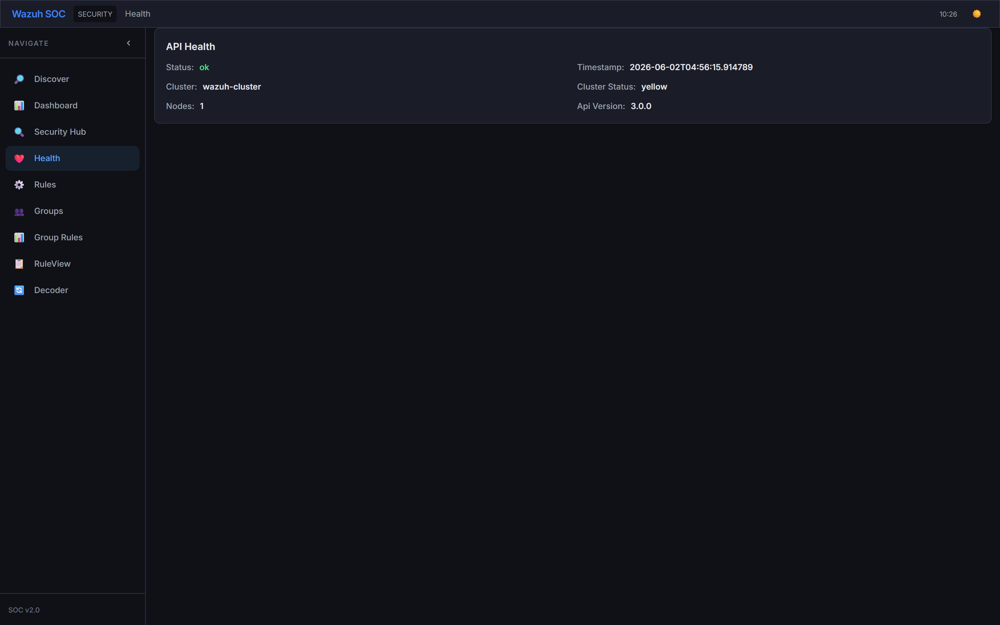

# Wazuh SOC Dashboard

A professional Security Operations Center (SOC) dashboard built with React + Vite + Tailwind CSS, connecting to Wazuh API for security event monitoring and analysis.

---

## Features

### Tabs
- **Discover** — Full OpenSearch-style log exploration with DQL search, filter bar, histogram, sortable results table, row expansion (Table/JSON views), field sidebar with stats, column toggle/reorder. Includes **Apply Rules** toggle to evaluate enabled rules against live results with group-aware match badges & filter.
- **Dashboard** — Full SOC security dashboard with summary cards (24h/7d/30d counts, alert rate), severity distribution bars, alert timeline area chart, top rules/agents, categories donut chart, recent alerts feed — all auto-refreshing every 60s
- **Security Hub** — Centralized security findings overview
- **Health** — Wazuh cluster health, indices list, index stats
- **Rules** — Rule Engine with **Editor** and **Test Lab** sub-tabs. Create rules with nested condition groups, version history, bulk operations.
- **Groups** — Group CRUD management with name, description, color picker, and rule assignment checkboxes
- **Group Rules** — Full-page group rules manager with Recharts pie chart, drag-and-drop rule assignment, JSON export/import, merge dialog
- **RuleView** — Browse rules in a readable card layout
- **Decoder** — Decoder management (Wazuh decoders)

### Rule Engine
- **Nested Condition Groups** — AND/OR groups with up to 3 levels of nesting, drag-and-drop reorder, flat/nested view toggle, max-depth warning
- **Version Control** — Automatic versioned saves (last 10), visual diff (green/red), rollback, compare any two versions, export version as new rule, save comments
- **Bulk Operations** — Find & Replace across nested conditions, bulk tagging, bulk export (JSON/Sigma/clipboard), bulk clone, bulk test, keyboard shortcut guide
- **Test Lab** — Dedicated testing environment with rule selection, JSON event editor, per-rule match/no-match results, persistent test history (last 50 runs)
- **Conditions**: field selectors with autocomplete (50+ Wazuh fields), operators (equals/contains/regex/startsWith/endsWith/gt/lt/inList/exists), NOT negation
- **Actions**: alert (severity + custom level 0-15 + interpolated message), tag, ignore
- **Overwrite mode** — when enabled, rule overrides `rule.level` and `rule.description` in Discover tab
- **Ignore IPs** — CIDR-based IP exclusion per rule
- **Apply Rules in Discover** — Toggle in Discover tab to see rule-matched alerts with severity-colored badges, overridden level/description, row highlighting
- **Import/Export** — JSON-based rule sharing between instances

### Rule Groups
- **Group CRUD** — create/edit/delete groups with name, description, and 12 preset colors
- **Many-to-Many** — rules can belong to multiple groups via `groupIds: []`
- **Group Sidebar** — collapsible filter sidebar with search, drag-and-drop reorder, context menu (edit/delete/selectAll/deselectAll)
- **Bulk Actions** — floating toolbar for bulk add/move/remove/delete/enable/disable with progress bar & keyboard shortcuts (Ctrl+A, Escape, Delete)
- **Group Rules Manager** — full-page two-panel layout with Recharts pie chart, drag-and-drop rule assignment, JSON export/import, merge dialog (move/copy)
- **Discover Integration** — color-coded group badges on matched rules, group filter dropdown in stats bar, per-group match breakdown chips
- **ResultsTable** — RuleBadge shows up to 2 group color dots + group name parenthetical
- **Toast Notifications** — animated undo-supported toasts for all group operations (add/move/remove/delete/enable/disable)
- **Persistence** — automatic migration of existing rules (adds `groupIds: []`), backup/restore, conflict resolution, orphan cleanup

### UI/UX
- **Inter font** with professional color palette (`#3b82f6` accent blue)
- **Dark/Light mode** with smooth transitions
- **EUI-style components**: Refresh Interval (number + unit select + Start/Stop), Date Range Picker with quick selects
- **Responsive sidebar** with collapse toggle (SVG chevron icons)
- **Field type tokens** — T (string), # (number), ✓ (boolean), D (date), IP, {} (object), [] (array)
- **Hover-reveal action buttons** — filter for, filter out, toggle column, filter exists on every table cell and doc viewer row
- **Custom scrollbar** styling (8px, border-clipping gap, Firefox `scrollbar-width: thin`)
- **Copy JSON** button in Doc Viewer JSON tab
- **Auto-refresh** timer with configurable interval (seconds/minutes/hours)

### Backend
- **Express.js proxy** server forwarding all requests to Wazuh API
- **Endpoints**: `/api/search`, `/api/count`, `/api/aggregate`, `/api/fields`, `/api/health`, `/api/indices`, `/api/index-stats`, `/api/scan`, `/api/geo`, `/api/dashboard` (parallel 9-call aggregate)
- **JWT Authentication** — automatic token acquisition via `WAZUH_USER`/`WAZUH_PASSWORD` with 5-min refresh; falls back to no auth if credentials not set
- **120s timeout** for large result sets (7.9M+ events)
- **SPA fallback** — serves built React app from `dist/`

---

## Screenshots — All Features

| Discover — Log Explorer | Filter Editor |
|:---:|:---:|
|  |  |

| SOC Dashboard | Security Hub |
|:---:|:---:|
|  |  |

| Health — Cluster & Indices | Rules — Nested Condition Groups |
|:---:|:---:|
|  |  |

| Rules — Version History | Groups Management |
|:---:|:---:|
|  |  |

| Group Rules Manager | RuleView — Browse Rules |
|:---:|:---:|
|  |  |

---

## Setup

### Prerequisites

- Node.js (v18+)
- Wazuh API endpoint (default: `http://192.168.1.77:9999`)

### Environment

Create `.env` in project root:

```
WAZUH_API_URL=http://192.168.1.77:9999
WAZUH_USER=admin
WAZUH_PASSWORD=your_password
PORT=3000
```

### Install & Run

```bash
npm install
npm run dev        # dev mode (Vite HMR on :5173)
# or
npm run build      # production build
npm start          # serve built app on :3000
```

- Dev: **http://localhost:5173**
- Production: **http://localhost:3000**

---

## Tech Stack

| Layer | Library |
|-------|---------|
| Framework | React 18 + Vite 5 |
| Styling | Tailwind CSS 3 + Framer Motion |
| Charts | Recharts |
| Tables | @tanstack/react-table |
| Backend | Express.js |
| HTTP | Axios |
| Date | Day.js |

---

## Project Structure

```
src/
  api.js              — Axios client (baseURL: /api, timeout: 120s)
  App.jsx             — Root layout, tab routing, sidebar + navbar
  main.jsx            — Entry point
  index.css           — Tailwind + custom component classes
  context/
    AppContext.jsx     — Global state (search, filters, columns, refresh, theme, groups)
    ToastContext.jsx   — Toast notification system with undo support
  components/
    Navbar.jsx        — Top bar with theme toggle + clock
    Sidebar.jsx       — Collapsible nav with 10 tabs
    QueryBar.jsx      — DQL input, quick dates, filter bar, refresh interval
    DateRangePicker.jsx
    RefreshInterval.jsx — EUI-style auto-refresh controls
    Histogram.jsx     — Time-series bar chart
    ResultsTable.jsx  — Sortable, filterable results with row expansion & rule badges
    DocViewer.jsx     — Table/JSON views with field tokens + action buttons
    FieldSidebar.jsx  — Field list with stats popover
    SocDashboard.jsx  — Full SOC dashboard: 7 widgets with live Wazuh data
    RuleBuilder.jsx   — Full rule editor with nested condition groups, version history sidebar
    GroupSidebar.jsx  — Collapsible group filter sidebar with DnD reorder & context menu
    GroupBulkActions.jsx — Floating toolbar with Find & Replace, Bulk Tag, Bulk Export, Bulk Clone, Bulk Test
    ConditionGroupEditor.jsx — Recursive nested group editor with drag-and-drop, flat/nested toggle
    VersionHistoryPanel.jsx — Version list, diff, rollback, compare, export
    TestLab.jsx       — Dedicated test environment with history persistence
  services/
    ruleStorage.js    — localStorage CRUD with versioned saves, tags support
    ruleEngine.js     — Recursive rule evaluation engine: nested groups, CIDR match, interpolation
    ruleGroupManager.js — High-level group business logic (add/move/remove/stats)
    rulePersistence.js  — Migration, backup/restore, conflict resolution
    undoManager.js    — Undo history with 5-second window & subscribe pattern
  tabs/
    DiscoverTab.jsx   — Group-aware match badges, filter dropdown, breakdown chips
    DashboardTab.jsx
    SecurityHubTab.jsx
    HealthTab.jsx
    RulesTab.jsx      — Sub-tab navigation (Editor / Test Lab)
    RuleGroupsTab.jsx — Group CRUD with color picker & rule assignment
    GroupRulesTab.jsx — Full page: pie chart, drag-drop, export/import, merge
    RuleViewTab.jsx
    DecoderTab.jsx
server/
  server.cjs          — Express proxy + static file serving
```

---

## Changelog

| Date | Change |
|------|--------|
| Initial | Project setup with Vite + React, Express proxy to Wazuh API |
| Added | Discover tab with DQL search, histogram, results table, field sidebar |
| Added | Scan, Analytics, Geo, Health, Indices tabs |
| Added | Date range picker with quick selects, column sort/move/remove |
| Added | Doc Viewer with Table/JSON tabs, field type tokens, filter action buttons |
| Added | Refresh interval component with auto-refresh timer |
| Improved | Pro design overhaul — Inter font, new color palette, dark/light mode |
| Improved | Sidebar with SVG collapse, rounded active state, hover effects |
| Improved | Scrollbar styling, badge colors, card shadows |
| Fixed | Server timeouts increased to 120s for large datasets |
| Fixed | Circular dependency in dynamic import — switched to static import |
| Added | SOC Dashboard with 7 live widgets via `/api/dashboard` endpoint |
| Added | Auto-refresh every 60s on Dashboard tab |
| Added | Rule Engine — RuleBuilder with conditions, actions, overwrite mode, ignore IPs, import/export, dashboard stats, test panel, batch testing |
| Added | Apply Rules in Discover tab — client-side rule evaluation, severity-colored Rule column, overridden level/description, row highlighting, stats bar |
| Added | Custom level override (0-15) in rule action params |
| Added | Expanded field selector with 50+ Wazuh fields + free-text input with datalist autocomplete |
| Added | Wazuh API JWT authentication — auto token acquisition via WAZUH_USER/WAZUH_PASSWORD |
| Added | Extract Fields button — parses pasted JSON and lists all available field paths |
| Added | **Rule Groups** — group CRUD, GroupSidebar, GroupBulkActions, GroupRulesTab, Discover integration |
| Added | ToastContext — animated toast notifications with undo support (5s auto-dismiss) |
| Added | undoManager — 5-second undo window with subscribe/notify pattern |
| Added | rulePersistence — migration, backup/restore, conflict resolution, storage info |
| Added | **Nested Condition Groups** — AND/OR groups with up to 3 levels nesting, drag-and-drop, flat/nested view toggle, recursive evaluation |
| Added | **Version Control** — versioned saves (last 10), visual diff (diff library), rollback, compare, export as new rule, save comments |
| Added | **Bulk Operations** — Find & Replace, Bulk Tag, Bulk Export (JSON/Sigma/clipboard), Bulk Clone, Bulk Test, keyboard shortcut guide |
| Added | **Test Lab** — rule selection, JSON event editor, per-rule match/no-match results, persistent history in localStorage |
| Added | **Rules sub-tabs** — Editor / Test Lab navigation with animated transitions |

---

## GitHub

Repository: https://github.com/Gopal-DevSecOps/wazuh-discover.git
