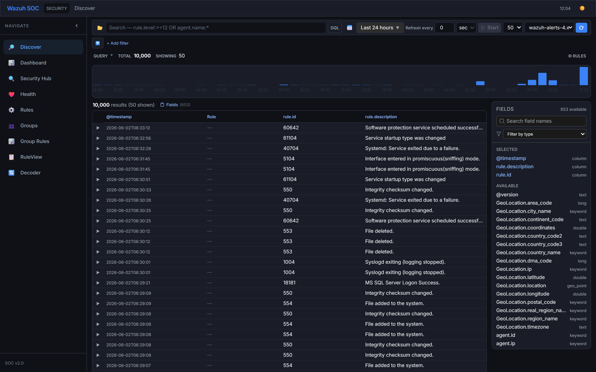
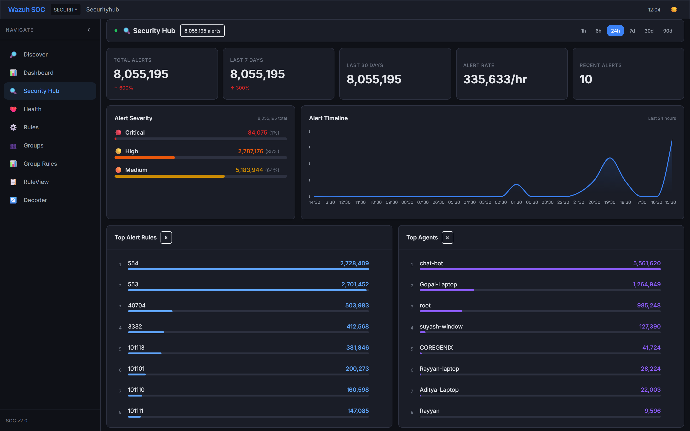
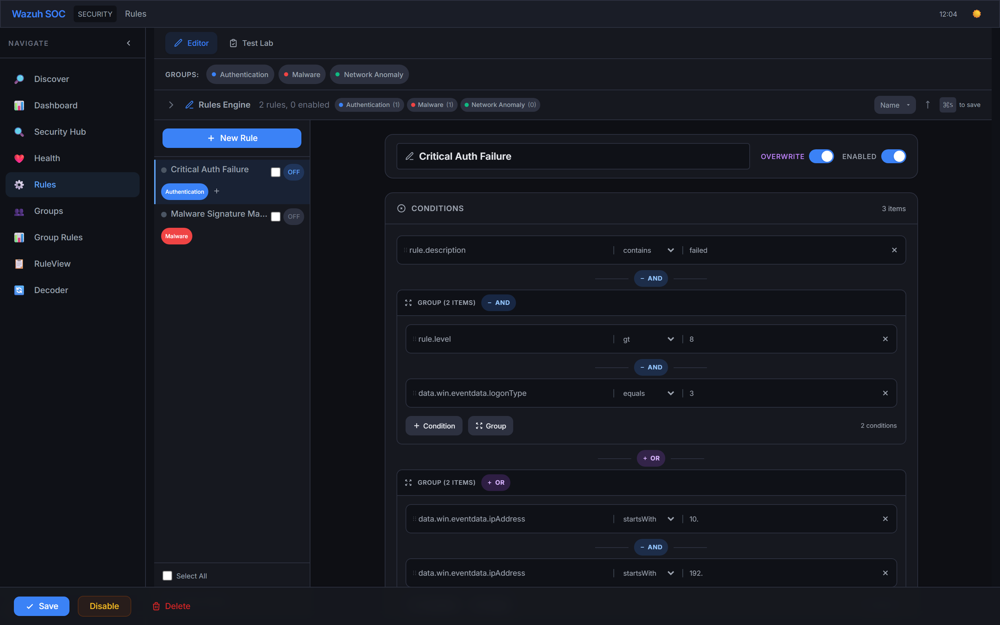
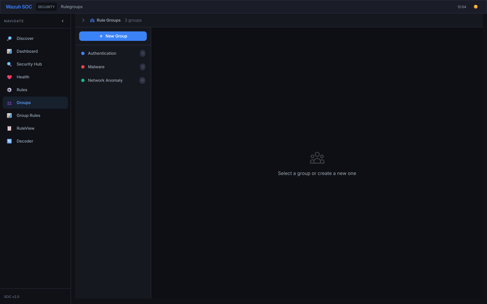
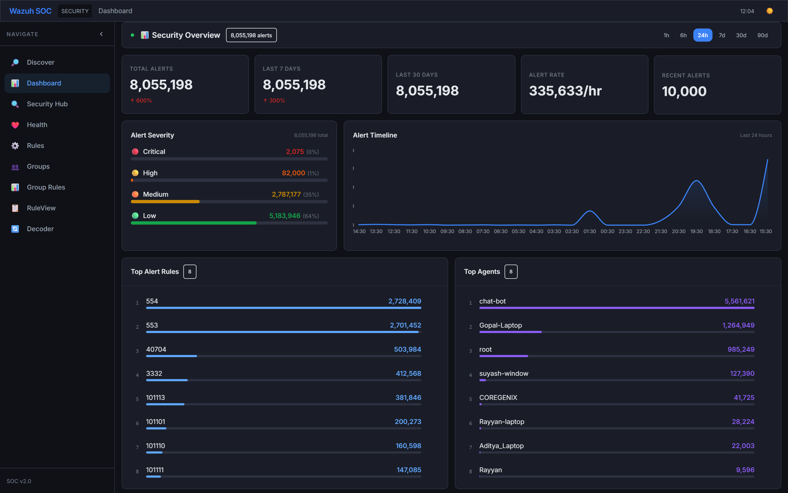
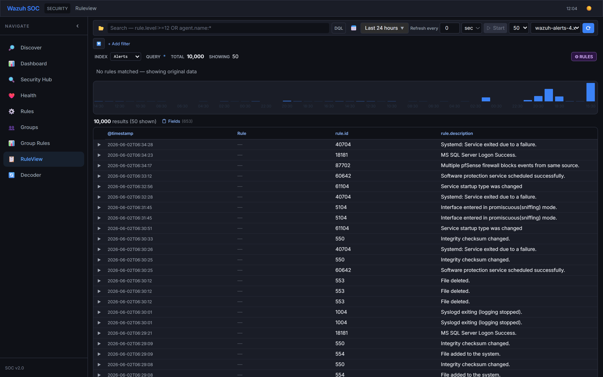
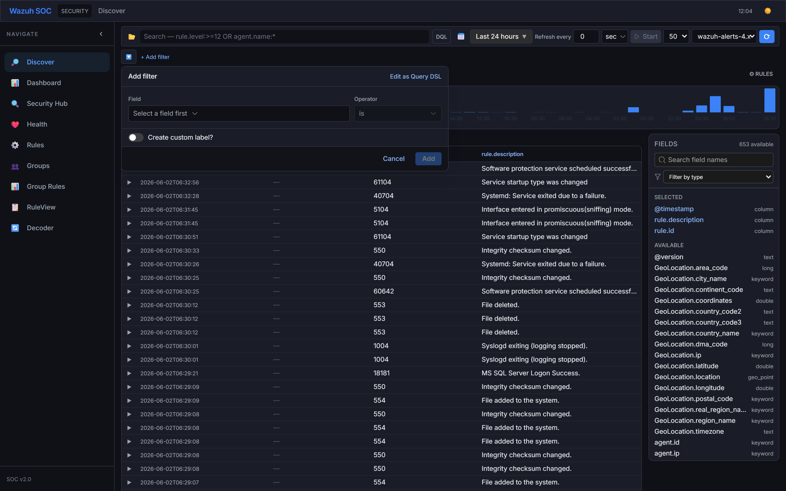

# UniShield360 SOC Dashboard

Enterprise-grade Security Operations Center dashboard for UniShield360 SIEM. Real-time alert monitoring, rule management, geo-tracking, and comprehensive analytics.


---

## Features

### Discover (SIEM Search)
Full-text search with DQL, field filters, date range picker, auto-refresh, server-side pagination, column drag-and-drop.



### Dashboard
Alert timeline histogram, rule-level distribution, top rules/agents/categories, recent alerts with drill-down.


### Security Hub
Multi-tab security overview, alert level distribution over time, drill-down to specific time ranges.



### Rules Engine
Visual rule builder with nested AND/OR conditions, rule evaluation engine with priority/overwrite, version history with diff/rollback, test lab with sample event simulation, bulk operations.




### Rule Groups
Group management with search, rule-group assignments, bulk add/move/copy.




### Rule View
Apply custom rules on search results, compare custom vs Wazuh manager rules, resizable splitter between histogram and results.



### Filter Editor
Advanced filter building with field autocomplete, value suggestions, AND/OR logic.



### Geo Tracking
GeoIP data visualization with location-based alert aggregation.

### Additional Tools
- Index browser and health monitoring
- Log decoder/parser with format detection
- Scan results viewer
- Raw search endpoint access

---

## Quick Start

```bash
# Install dependencies
npm install

# Configure environment
cp .env.example .env
# Edit .env with your Wazuh API credentials:
#   UNISHIELD360_API_URL=https://your-wazuh-manager:55000
#   UNISHIELD360_USER=your-username
#   UNISHIELD360_PASSWORD=your-password

# Start development server (frontend + API proxy)
npm start

# Or run separately:
npm run dev     # Vite dev server on :5173
npm run server  # Express proxy on :3000
```

---

## Architecture

```
┌─────────────┐     ┌──────────────┐     ┌─────────────┐
│   React     │────▶│  Express.js  │────▶│  Wazuh API  │
│   (Vite)    │◀────│   Proxy (:3000)│◀────│  (:55000)   │
└─────────────┘     └──────────────┘     └─────────────┘
       │                                        │
       │                                        │
       ▼                                        ▼
  localStorage                           OpenSearch
  (rules, groups,                          (alerts)
   saved searches)
```

### Key Technologies
- **Frontend:** React 18 + Vite 5, Tailwind CSS 3, Framer Motion
- **Visualization:** Recharts (bar, pie, area, line charts)
- **PDF Export:** jsPDF + jspdf-autotable
- **Backend:** Express.js proxy with JWT auth
- **Data Storage:** localStorage (rules/groups), OpenSearch (alerts via Wazuh API)
- **Real-time:** WebSocket-based alert streaming

---

## Features Detail

### Hierarchical Sidebar Navigation
- Collapsible sidebar with grouped navigation
- Rules section with expandable children: Create Rule, Groups, Rule View, Rule Guide
- Smooth animations with framer-motion

### Create Rule (Rule Builder)
- Visual condition builder with nested AND/OR groups
- Field autocomplete with search
- GDPR field detection and article mapping
- Rule test lab with JSON test events
- Version history with diff comparison and rollback
- Bulk group assignment
- Resizable sidebar with rule list search

### Group Management
- Searchable group list
- Group creation, editing, deletion
- Rule-group assignment with bulk operations
- Drag-and-drop condition reordering

### Resizable Panels
- All main panels support resize via draggable splitter bars
- Right-side fields panel toggleable per tab
- Persisted panel widths in localStorage
- Orange accent drag handles

### Index Pattern Mapping
- Frontend uses `unishield360-*` index names
- Server auto-maps to `wazuh-*` for API calls
- Response interceptor rewrites `_index` fields in returned data

### Authentication
- JWT-based authentication
- Login modal with role-based access
- Notification settings for admin users

---

## UI Components

| Component | Location | Description |
|---|---|---|
| `Navbar` | `src/components/Navbar.jsx` | Top bar with branding, search actions, reporting |
| `Sidebar` | `src/components/Sidebar.jsx` | Hierarchical left navigation |
| `QueryBar` | `src/components/QueryBar.jsx` | DQL input, filter chips, date picker, index selector |
| `ResultsTable` | `src/components/ResultsTable.jsx` | Paginated data table with column drag-drop |
| `FieldSidebar` | `src/components/FieldSidebar.jsx` | Field explorer with type indicators |
| `Histogram` | `src/components/Histogram.jsx` | Time-based bar chart with range selection |
| `RuleBuilder` | `src/components/RuleBuilder.jsx` | Visual rule editor with conditions/actions |
| `ConditionGroupEditor` | `src/components/ConditionGroupEditor.jsx` | Nested AND/OR condition groups |
| `ResizablePanel` | `src/components/ResizablePanel.jsx` | Draggable splitter panels |
| `ResizableSplitter` | `src/components/ResizableSplitter.jsx` | Ratio-based split layout |

## Pages / Tabs

| Tab | File | Purpose |
|---|---|---|
| Discover | `DiscoverTab.jsx` | Main SIEM search |
| Dashboard | `SocDashboard.jsx` | Alert overview and statistics |
| Security Hub | `SecurityHub.jsx` | Multi-view security analysis |
| Rules | `RulesTab.jsx` | Rule CRUD and management |
| Create Rule | `CreateRuleTab.jsx` | New rule editor |
| Rule Groups | `RuleGroupsTab.jsx` | Group management |
| Rule View | `RuleViewTab.jsx` | Rule application on results |
| Rule Guide | `RuleGuideTab.jsx` | Rule writing documentation |
| Decoder | `DecoderTab.jsx` | Log parsing |
| Health | `HealthTab.jsx` | API health monitoring |
| Scan | `ScanTab.jsx` | Security scan results |
| Geo | `GeoTab.jsx` | GeoIP data |
| Search | `SearchTab.jsx` | Raw API search |

## API Endpoints

All proxied through Express to Wazuh API:

| Endpoint | Methods | Purpose |
|---|---|---|
| `/api/search` | GET | Event search with pagination |
| `/api/scan` | GET/POST | Deep pagination (no 10k limit) |
| `/api/count` | GET | Document count |
| `/api/aggregate` | GET | Field aggregations & histograms |
| `/api/fields` | GET | Index field mapping |
| `/api/indices` | GET | Index listing |
| `/api/health` | GET | API health check |
| `/api/dashboard` | GET | Aggregated dashboard data |
| `/api/geo` | GET | GeoIP aggregation |
| `/api/wazuh-rules` | GET | Fetch Wazuh manager rules |

## Development

```bash
# Run with hot-reload
npm run dev

# Build for production
npm run build

# Preview production build
npm run preview

# Start API proxy only
npm run server
```

## License

MIT
